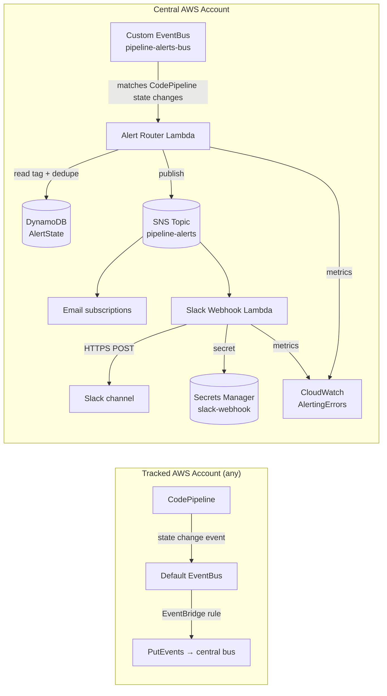

# Design — Pipeline Failure Alerts

## Overview

Pipeline Failure Alerts adds proactive notifications on top of the existing
multi-account pipeline dashboard. CodePipeline state-change events from every
tracked account are forwarded into a central EventBridge bus, classified by an
"alert router" Lambda using a per-pipeline severity tag, deduped against a
DynamoDB state table, and published to an SNS topic that fans out to email and
Slack.

The design reuses the established pattern from `cross-account-reader`: a
small IAM/permissions resource lives in each tracked account, while all
business logic and data live in the central account.

## Architecture



Key choices:

- **Push, not pull.** Events flow into the central bus within seconds of a
  state change. We don't poll CodePipeline (Requirement 1.1's 60-second SLA).
- **One central bus.** Simpler IAM, single point to add filters, single point
  to disable.
- **DynamoDB for state.** Holds last-known status per pipeline + a sliding
  window of failures. Tiny footprint, on-demand billing.
- **Two Lambdas, single responsibility.** Router decides *whether* to alert.
  Slack subscriber decides *how* to format. Email is direct SNS subscription.
- **Secret isolation.** Slack webhook lives in Secrets Manager; Lambda has
  `secretsmanager:GetSecretValue` only on that ARN.

## Components and Interfaces

### 1. `terraform/cross-account-reader/` (modified)

Existing module gains one statement: `events:PutEvents` scoped to the central
event bus ARN. No change to the existing read scope (Requirement 6.1). The
reader role is what the local event-forwarding rule assumes.

Each target account also gets a new `aws_cloudwatch_event_rule` that matches
CodePipeline state changes (`source = "aws.codepipeline"`,
`detail-type = "CodePipeline Pipeline Execution State Change"`) and targets
the central bus via the reader role.

### 2. `terraform/pipeline-alerts/` (new root module)

New stack alongside `dashboard-backend`. Provisions everything central:

- `aws_cloudwatch_event_bus.alerts` — name `pipeline-alerts-bus`. Resource
  policy allows `events:PutEvents` only from explicit principals
  (tracked account IDs from `var.tracked_accounts`), no wildcards
  (Requirement 6.2).
- `aws_cloudwatch_event_rule.failures` — matches FAILED, SUCCEEDED, CANCELED,
  SUPERSEDED state-change events on the alerts bus and invokes the router
  Lambda.
- `aws_dynamodb_table.alert_state` — single-table design (PK = pipeline ARN).
  Holds `last_status`, `consecutive_failures`, `last_alert_at`,
  `last_event_at`. TTL 30 days.
- `aws_lambda_function.router` — see Component 3.
- `aws_sns_topic.alerts` — fans out to email + Slack Lambda.
- `aws_sns_topic_subscription.email` — one per `var.alert_emails`.
- `aws_lambda_function.slack` — see Component 4.
- `aws_secretsmanager_secret.slack_webhook` — holds the webhook URL.
- `aws_cloudwatch_metric_alarm.alerting_errors` — pages when router/Slack
  Lambdas error > 5 in 5 min (Requirement 5.1).

Variables:

- `tracked_accounts` — same shape as in `dashboard-backend` so the operator
  copy-pastes once. Drives the bus resource policy and the StackSet
  (organizations.tf-parallel).
- `alert_emails` — list of email addresses to subscribe.
- `slack_webhook_url` — sensitive; passed once at deploy, stored in Secrets
  Manager, then removed from Terraform state via `ignore_changes`.

### 3. Router Lambda (`lambda/router/`)

Runtime: Python 3.12. Triggered by EventBridge rule.

Pseudocode:

```python
def handler(event, context):
    detail = event["detail"]
    pipeline_arn = build_arn(detail)
    state = detail["state"]           # FAILED | SUCCEEDED | CANCELED | SUPERSEDED
    if state in ("CANCELED", "SUPERSEDED"):
        return                         # Requirement 1.3

    record = ddb.get(pipeline_arn)     # may be empty
    severity = read_tag(pipeline_arn) or "medium"  # Requirement 2.2

    if state == "SUCCEEDED":
        if record and record["last_status"] == "FAILED":
            publish_recovery(detail, severity)     # Requirement 1.2
        ddb.update(pipeline_arn, last_status="SUCCEEDED", consecutive_failures=0)
        return

    # state == "FAILED"
    consecutive = (record["consecutive_failures"] + 1) if record else 1
    should_alert = decide(severity, consecutive, record)  # Requirement 2.3-5
    if should_alert:
        publish_failure(detail, severity)
    ddb.update(pipeline_arn,
               last_status="FAILED",
               consecutive_failures=consecutive,
               last_alert_at=now() if should_alert else record.get("last_alert_at"))
```

`decide()` enforces:

- `high` → always alert on FAILED.
- `medium` → alert unless `now() - last_alert_at < 15min` (Requirement 2.4).
- `low` → alert only when `consecutive >= 2` (Requirement 2.5).

The pipeline ARN tag is read by `tag.get_resources` with `ResourceTypeFilters
= ["codepipeline:pipeline"]`. To read tags from a tracked account, the router
assumes that account's existing reader role (which it can do today).

### 4. Slack Lambda (`lambda/slack/`)

Triggered by SNS. Fetches webhook URL from Secrets Manager on cold start
(cached for the container lifetime). Formats the SNS message as Slack
blocks (pipeline name, account alias, severity, failed stage, console
link, color = red for FAILED / green for RECOVERY).

Retry: up to 3 attempts with exponential backoff on non-2xx
(Requirement 3.4). Failure logs include the SNS message ID for traceability.

### 5. Heartbeat checker (CloudWatch scheduled rule)

`aws_cloudwatch_event_rule.heartbeat` — daily schedule. Targets the router
Lambda with a synthetic `{"detail-type":"HeartbeatCheck"}` event. The router
scans `last_event_at` per tracked account; if any account has been silent
> 24h, it emits a `HEARTBEAT_LOST` alert (Requirement 1.4).

### 6. Makefile additions

```make
deploy-alerts:
	@if [ -z "$(EMAIL)" ] || [ -z "$(SLACK_WEBHOOK)" ]; then \
	  echo "Usage: make deploy-alerts EMAIL=ops@example.com SLACK_WEBHOOK=https://..."; exit 1; \
	fi
	$(MAKE) deploy TF_DIR=terraform/pipeline-alerts \
	  TF_VAR_alert_emails='["$(EMAIL)"]' \
	  TF_VAR_slack_webhook_url='$(SLACK_WEBHOOK)'

disable-alerts:
	aws events disable-rule \
	  --name pipeline-alerts-failures \
	  --event-bus-name pipeline-alerts-bus \
	  --region $(AWS_REGION)
```

`disable-alerts` only disables the rule; Terraform state is untouched
(Requirement 4.4).

### 7. Dashboard backend (small touch)

The existing `/accounts` endpoint adds a `last_alert_event_at` field per
account, read from the new DynamoDB table (Requirement 5.3). This is the
only change outside the new stack.

## Data models

### DynamoDB: `pipeline-alert-state`

| Attribute | Type | Notes |
|---|---|---|
| `pipeline_arn` (PK) | S | `arn:aws:codepipeline:us-east-1:111122223333:my-pipeline` |
| `account_id` | S | Denormalized for the heartbeat scan |
| `last_status` | S | `FAILED` \| `SUCCEEDED` |
| `consecutive_failures` | N | Reset to 0 on SUCCEEDED |
| `last_event_at` | N | Unix epoch seconds |
| `last_alert_at` | N | Unix epoch seconds; null if never alerted |
| `severity_cached` | S | Last-seen tag value, for the heartbeat path |
| `ttl` | N | `last_event_at + 30 days`, drives TTL deletion |

GSI `by_account` on `account_id` → enables the dashboard's
`last_alert_event_at` lookup without scanning.

### SNS message envelope

```json
{
  "version": "1",
  "type": "FAILED" | "RECOVERY" | "HEARTBEAT_LOST",
  "severity": "high" | "medium" | "low",
  "pipeline_name": "string",
  "pipeline_arn": "string",
  "account_id": "string",
  "account_alias": "string",
  "region": "string",
  "execution_id": "string",
  "failed_stage": "string | null",
  "timestamp": "ISO-8601",
  "console_url": "string"
}
```

## Error handling

| Failure mode | Behavior |
|---|---|
| Target account fails to PutEvents | EventBridge logs the failure; we expose this via CloudWatch metric `FailedInvocations` on the local rule. No retry from our side. |
| Router Lambda throws | EventBridge retries with default policy (2 attempts, then DLQ). DLQ = SQS queue `pipeline-alerts-dlq`. Alarm on DLQ depth ≥ 1. |
| DynamoDB conditional update conflict | Router retries up to 3 times (alerts are infrequent; contention is unlikely). |
| Slack webhook 4xx (e.g. revoked) | Logged and metric'd; not retried (retry won't help). Operator gets the `AlertingErrors` alarm. |
| Secrets Manager read fails | Slack Lambda errors → caught by `AlertingErrors`. Email still delivers because it's a direct SNS subscription. |
| Tag read fails (assume-role error) | Default to `medium`, log the failure. Don't block alerting. |

## Testing strategy

### Unit tests (Router Lambda)

Run with `pytest` in `lambda/router/tests/`. No AWS calls — mock DynamoDB and
the tag lookup. Cover:

- `decide()` returns correct answer for each severity × state × history combo.
- ARN parsing handles every region/account variant.
- Recovery detection fires once and only once.

### Property-based tests (`hypothesis`)

PBT is mandatory per the workflow. Properties to encode in
`lambda/router/tests/test_properties.py`:

1. **No alert storms.** For any sequence of FAILED events for a medium-
   severity pipeline within a 15-min window, exactly one alert is emitted.
2. **Recovery requires preceding failure.** A RECOVERY alert is emitted only
   when the immediately prior recorded status was FAILED.
3. **Idempotence under replay.** Replaying the same EventBridge event N
   times produces the same DynamoDB state and at most one alert (EventBridge
   at-least-once delivery is assumed).
4. **Severity monotonicity.** Holding state and history fixed, `high`
   produces ≥ as many alerts as `medium`, and `medium` ≥ `low`.
5. **Tag default safety.** Missing/invalid tags never cause an exception and
   always behave as `medium`.

Generators produce arbitrary sequences of `(state, timestamp, severity)`
tuples; the test drives `handler()` and asserts the four properties.

### Integration tests

- `pytest` + `moto` to spin up DynamoDB + SNS locally and run the router
  end-to-end on canned EventBridge payloads.
- Manual smoke: `aws events put-events` with a fake CodePipeline state-change
  payload against the dev central bus and confirm Slack/email delivery.

### Terraform validation

- `make tf-validate TF_DIR=terraform/pipeline-alerts`
- `checkov-on-save` hook covers static IAM/network policy checks.

## Correctness Properties

The PBT suite must keep these green:

### Property 1: AlertOnce

**Validates: Requirements 2.4**

For any window of FAILED events on the same pipeline within 15 minutes at
medium severity (`AlertOnce(window=15m, severity=medium)`), exactly one alert
is emitted.

### Property 2: RecoveryImpliesPriorFailure

**Validates: Requirements 1.2, 2.6**

∀ RECOVERY alert e, ∃ FAILED alert e' with `e'.timestamp < e.timestamp` and
no SUCCEEDED between them.

### Property 3: Idempotence

**Validates: Requirements 1.1, 1.2**

`handler(event) ∘ handler(event)` ≡ `handler(event)` in terms of side
effects.

### Property 4: SeverityMonotonicity

**Validates: Requirements 2.3, 2.4, 2.5**

alerts(high, h) ≥ alerts(medium, h) ≥ alerts(low, h) for any history h.

### Property 5: TagFailSafe

**Validates: Requirements 2.2**

No tag-read exception ever propagates to EventBridge; absence of tag ⇒
severity = medium.

## Security posture

- Central event bus resource policy: explicit account IDs, no `*`.
- Reader role gains only `events:PutEvents` on the bus ARN (Requirement 6.1).
- Slack webhook URL: Secrets Manager only; `ignore_changes` on the secret
  version so Terraform state never holds the value (Requirement 6.3).
- Lambda env vars: only `STATE_TABLE`, `SNS_TOPIC_ARN`, `SECRET_ARN`. No
  webhook URLs, no API keys.
- Both Lambdas: log group retention 14 days; PII in payloads = pipeline
  names only (no customer data).
- IAM is checked by the existing `checkov-on-save` hook.

## Open questions

These didn't block the design but should be confirmed before/during tasks:

1. Should the new stack go in `terraform/pipeline-alerts/` (new root) or as a
   sub-module under `dashboard-backend`? Design assumes new root.
2. Slack message format: plain text vs Block Kit? Design assumes Block Kit
   for the richer recovery indicator.
3. Heartbeat granularity — daily is the floor; do we want hourly?
