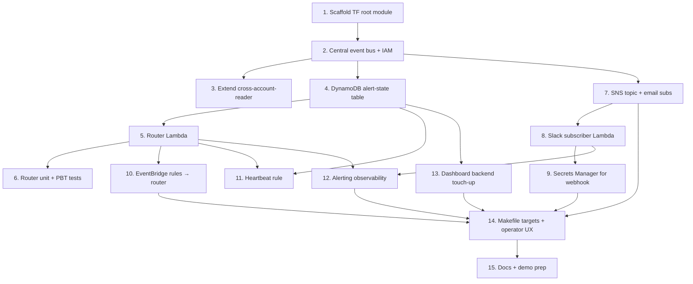

# Implementation Plan — Pipeline Failure Alerts

## Overview

This plan covers building the central `terraform/pipeline-alerts/` stack, extending
`cross-account-reader` to forward CodePipeline state-change events, implementing
the router and Slack subscriber Lambdas with property-based tests, wiring SNS +
email delivery, handling the Slack webhook secret, adding observability for the
alerting system itself, touching up the dashboard backend, and polishing the
operator UX. The work is sequenced across 15 tasks; each task is a small,
testable slice and references its acceptance criteria in `requirements.md`.

## Tasks

Each task is a small, testable slice. Subtasks are prerequisites within their parent.
Numbers reference acceptance criteria in `requirements.md` (R1.1, R2.4, etc.).

- [ ] 1. Scaffold the new Terraform root module
- [ ] 1.1 Create `terraform/pipeline-alerts/` with `providers.tf`, `variables.tf`, `main.tf`, `outputs.tf` matching the project's existing style (2-space HCL, pinned provider versions, `Project` tag default)
- [ ] 1.2 Declare variables: `aws_region`, `project_name`, `tracked_accounts` (same shape as `dashboard-backend`), `alert_emails` (list(string)), `slack_webhook_url` (sensitive)
- [ ] 1.3 Wire `make plan` / `make deploy` smoke run with empty inputs to confirm the module is initializable
  - _Requirements: R4.3_

- [ ] 2. Provision the central event bus and ingress IAM
- [ ] 2.1 Create `aws_cloudwatch_event_bus.alerts` named `${project_name}-alerts-bus`
- [ ] 2.2 Build the bus resource policy: `events:PutEvents` allowed only from the explicit list of `tracked_accounts[*].account_id`, no wildcards
- [ ] 2.3 Add a regression-style unit test (terratest or `terraform plan -json` parse) asserting the policy contains no `Principal = "*"`
  - _Requirements: R6.2_

- [ ] 3. Extend `cross-account-reader` to forward CodePipeline events
- [ ] 3.1 Add `events:PutEvents` statement to the reader role's policy, scoped to the central bus ARN passed as a new variable `central_event_bus_arn`
- [ ] 3.2 Add an `aws_cloudwatch_event_rule` in the target account matching `source = "aws.codepipeline"` and `detail-type = "CodePipeline Pipeline Execution State Change"`, targeting the central bus via the reader role
- [ ] 3.3 Update `make track-account` to pass the central bus ARN automatically by reading `terraform output` from the new alerts stack
  - _Requirements: R1.1, R4.1, R6.1_

- [ ] 4. Provision the alert-state DynamoDB table
- [ ] 4.1 `aws_dynamodb_table.alert_state` with PK `pipeline_arn` (S), on-demand billing, TTL on `ttl`, GSI `by_account` on `account_id`
- [ ] 4.2 Output the table name from the alerts stack
  - _Requirements: R2.4, R2.5, R5.3_

- [ ] 5. Implement the router Lambda
- [ ] 5.1 Create `terraform/pipeline-alerts/lambda/router/` with `handler.py`, `decide.py`, `dynamo.py`, `tags.py`
- [ ] 5.2 Implement `decide(severity, state, record, now)` as a pure function — no I/O, fully unit-testable
- [ ] 5.3 Implement `handler(event, context)` per the pseudocode in design.md: classify state → read tag → call `decide` → conditional DDB update → conditional SNS publish
- [ ] 5.4 Default severity to `medium` when tag read raises or returns an unrecognized value
- [ ] 5.5 Skip CANCELED and SUPERSEDED events early
  - _Requirements: R1.1, R1.2, R1.3, R2.1, R2.2, R2.3, R2.4, R2.5, R2.6_

- [ ] 6. Unit and property-based tests for the router
- [ ] 6.1 `pytest` setup in `lambda/router/tests/` with `moto` for DynamoDB
- [ ] 6.2 Conventional unit tests for `decide()` covering each severity × state × history combo
- [ ] 6.3 Property-based tests (`hypothesis`) encoding the five canonical properties:
  - `AlertOnce` (15-min window for medium)
  - `RecoveryImpliesPriorFailure`
  - `Idempotence` under event replay
  - `SeverityMonotonicity`
  - `TagFailSafe`
- [ ] 6.4 CI hook or Makefile target `make test-alerts` to run the suite
  - _Requirements: R1.2, R1.3, R2.2, R2.4, R2.5, R2.6_

- [ ] 7. Provision SNS + email subscriptions
- [ ] 7.1 `aws_sns_topic.alerts` with KMS encryption (`aws/sns` or customer key)
- [ ] 7.2 `aws_sns_topic_subscription.email` resource per entry in `var.alert_emails`
- [ ] 7.3 IAM: router Lambda gets `sns:Publish` only on the topic ARN
  - _Requirements: R3.1, R3.2, R3.5_

- [ ] 8. Implement the Slack subscriber Lambda
- [ ] 8.1 Create `lambda/slack/handler.py` that consumes SNS events, fetches the webhook URL from Secrets Manager (cached), formats Block Kit, and POSTs
- [ ] 8.2 Implement retry: up to 3 attempts with exponential backoff on non-2xx; final failure logs `aws_request_id` + SNS message ID
- [ ] 8.3 Unit tests with `responses` (or `httpx_mock`) covering 2xx success, 4xx no-retry, 5xx retry-then-fail
  - _Requirements: R3.2, R3.3, R3.4_

- [ ] 9. Secret handling for the Slack webhook
- [ ] 9.1 `aws_secretsmanager_secret.slack_webhook` + `aws_secretsmanager_secret_version` (initial), with `lifecycle { ignore_changes = [secret_string] }` so subsequent applies don't store the value in plan output
- [ ] 9.2 Slack Lambda IAM: `secretsmanager:GetSecretValue` scoped to the secret ARN only
- [ ] 9.3 Confirm via `checkov` that no secret leaks into Lambda env vars or Terraform plan output
  - _Requirements: R6.3_

- [ ] 10. Wire EventBridge rules to the router
- [ ] 10.1 `aws_cloudwatch_event_rule.failures` on `pipeline-alerts-bus` matching the four relevant `state` values; target = router Lambda
- [ ] 10.2 Lambda permission resource so EventBridge can invoke the function
- [ ] 10.3 SQS DLQ `pipeline-alerts-dlq` attached to the rule target; alarm when `ApproximateNumberOfMessagesVisible >= 1`
  - _Requirements: R1.1, R5.1_

- [ ] 11. Heartbeat detection for silent accounts
- [ ] 11.1 `aws_cloudwatch_event_rule.heartbeat` on a daily schedule, target = router Lambda with payload `{"detail-type":"HeartbeatCheck"}`
- [ ] 11.2 Router branch: on HeartbeatCheck, scan `by_account` GSI, find accounts with `last_event_at` older than 24h that have sent events before, emit one `HEARTBEAT_LOST` alert per account, mark a `heartbeat_alerted_at` so it doesn't repeat
  - _Requirements: R1.4_

- [ ] 12. Observability of the alerting system itself
- [ ] 12.1 CloudWatch metric filter on both Lambda log groups for `level="ERROR"` → metric `AlertingErrors`
- [ ] 12.2 `aws_cloudwatch_metric_alarm.alerting_errors` — threshold 5 in 5 min, action = same SNS topic (eats its own dogfood)
- [ ] 12.3 Log group retention = 14 days on both Lambdas
  - _Requirements: R5.1, R5.2_

- [ ] 13. Dashboard backend touch-up
- [ ] 13.1 In `terraform/dashboard-backend/lambda/stats/`, add a `last_alert_event_at` field to each account in the `/accounts` response by querying the new DDB table's `by_account` GSI
- [ ] 13.2 Grant the existing stats Lambda role `dynamodb:Query` on the GSI ARN
- [ ] 13.3 Update the React dashboard's account list view to display "Last alert event" (formatted relative time)
  - _Requirements: R5.3_

- [ ] 14. Makefile targets and operator UX
- [ ] 14.1 Add `deploy-alerts EMAIL=… SLACK_WEBHOOK=…` and `disable-alerts` targets; both must idempotently work on re-run
- [ ] 14.2 Update `make help` text
- [ ] 14.3 Smoke test: run `make deploy-alerts` → publish a synthetic CodePipeline state-change to the bus via `aws events put-events` → confirm Slack + email delivery and DDB row written
  - _Requirements: R4.3, R4.4_

- [ ] 15. Docs and demo prep
- [ ] 15.1 Add a `Pipeline Failure Alerts` section to the project README covering: architecture diagram, onboarding flow, severity tag, troubleshooting (DLQ, AlertingErrors alarm)
- [ ] 15.2 Capture a short demo script: deploy → tag a pipeline `AlertSeverity=high` → force a build failure → show Slack + email + dashboard `last_alert_event_at` updating
- [ ] 15.3 Add `checkov` justifications inline for any findings that can't be remediated (`# checkov:skip=CKV_AWS_xxx: reason`)
  - _Requirements: project conventions_

## Task Dependency Graph



```json
{
  "waves": [
    { "id": 0, "tasks": ["1.1", "1.2", "1.3"] },
    { "id": 1, "tasks": ["2.1", "2.2", "2.3"] },
    { "id": 2, "tasks": ["3.1", "3.2", "3.3", "4.1", "4.2", "7.1", "7.2", "7.3"] },
    { "id": 3, "tasks": ["5.1", "5.2", "5.3", "5.4", "5.5", "8.1", "8.2", "8.3", "13.1", "13.2", "13.3"] },
    { "id": 4, "tasks": ["6.1", "6.2", "6.3", "6.4", "9.1", "9.2", "9.3", "10.1", "10.2", "10.3", "11.1", "11.2", "12.1", "12.2", "12.3"] },
    { "id": 5, "tasks": ["14.1", "14.2", "14.3"] },
    { "id": 6, "tasks": ["15.1", "15.2", "15.3"] }
  ]
}
```

## Notes

- Tasks 5 and 6 are the riskiest — the router's `decide()` logic plus the PBT
  suite encode the alerting semantics; budget extra time and pair-review here.
- Run `make tf-fmt` before every commit that touches Terraform.
- All Terraform edits are checked by the `checkov-on-save` Kiro hook; fix
  findings or add inline `# checkov:skip=...` justifications rather than
  ignoring them silently.
- The full PBT suite (`make test-alerts`) must pass green before starting
  task 15 — docs and the demo script assume the property guarantees hold.
- The end-to-end onboarding flow is validated in task 14.3: `make deploy-alerts`
  → synthetic `aws events put-events` → Slack + email delivery + DDB row.
- Optional/test-related subtasks are intentionally left unmarked here to
  preserve the original numbering; treat 6.x and 8.3 as test sub-tasks.
