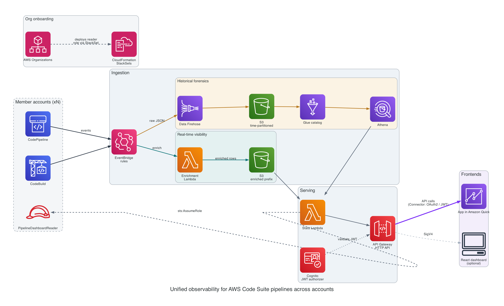
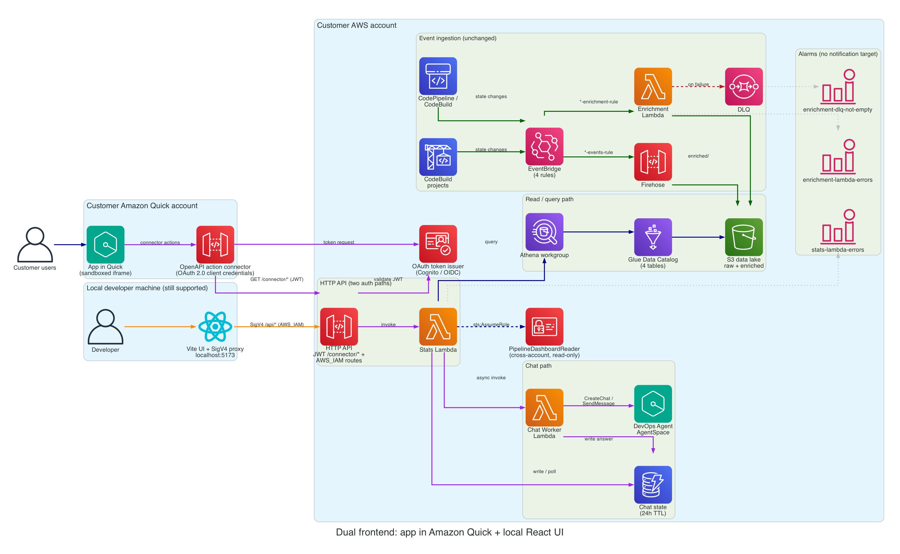

# AWS Code Suite Dashboard

_Cross-account visibility for AWS CodePipeline and CodeBuild, with an AWS DevOps Agent chat assistant._

It captures every pipeline execution and build event into a central data lake,
enriches it with per-stage detail, exposes it through an HTTP API, and renders
it as an **app in Amazon Quick**. A local React dashboard is included as an
optional developer view over the same API.

The dashboard also embeds an **AWS DevOps Agent** chat, so users can ask
natural-language questions about a specific pipeline ("why is this
failing?", "which stage is the bottleneck?") and get answers backed by
the agent's live investigation of AWS resources.

The infrastructure is deployed with **CloudFormation** (`cloudformation/`) —
three self-contained stacks (central backend, cross-account reader, and
optional sample pipelines) driven through the Makefile.

## Architecture

At a high level, pipeline and build events are captured, archived and enriched
in an S3 data lake, then served to a dashboard through an HTTP API:



A few design points worth calling out:

- **The same events fan out to two independent paths.** A cheap Firehose-to-S3
  archive keeps the full raw history for forensics, while an enrichment Lambda
  produces query-friendly rows for the live dashboard.
- **Multi-account aggregation uses AWS Organizations.** A CloudFormation
  StackSet deploys a read-only reader role into every member account; the stats
  Lambda assumes it to aggregate pipelines across the organization.
- **One API serves two frontends.** The app in Amazon Quick calls it through a
  JWT-authorized connector; the optional local React dashboard calls the same
  API with SigV4.

Diagrams are generated with the [`diagrams`](https://diagrams.mingrammer.com/)
library. See [`docs/diagrams/`](docs/diagrams/) for a per-concept diagram of
each point above (data paths, multi-account, serving), the detailed deployed
stack, and how to regenerate them.

### Primary frontend: an app in Amazon Quick

The dashboard is built as an **app in Amazon Quick**, reached through an
OAuth2-authorized OpenAPI **connector**. The connector adds a Cognito-backed
JWT authorizer and a set of flat, paginated `/connector/*` routes alongside the
backend's IAM routes.



See [`cloudformation/dashboard-backend/QUICK_APP_QUICKSTART.md`](cloudformation/dashboard-backend/QUICK_APP_QUICKSTART.md)
for the end-to-end deploy-and-build walkthrough.

### Optional frontend: the local React dashboard

For local development the same backend drives a React UI on
`http://localhost:5173`. The Vite dev server proxies `/api/*` to the HTTP API
and signs every request with SigV4 using the developer's local AWS credentials
(the Quick sandbox cannot sign SigV4, which is why the app uses the connector
instead) — the browser never sees AWS credentials and the API never accepts
unsigned requests.

## Repo layout

```
.
├── cloudformation/             # CloudFormation IaC (3 self-contained stacks)
│   ├── dashboard-backend/      # Lambdas, API GW, S3 + Glue + Athena, Firehose, EventBridge
│   ├── cross-account-reader/   # IAM role deployed into each target account
│   └── sample-pipelines/       # 3 demo pipelines (Python / Node / static) — OPTIONAL, for testing
├── frontend/                   # React + Vite + Tailwind UI (local-only)
├── scripts/                    # Python helpers (e.g. SigV4 API caller)
└── Makefile                    # single entrypoint — see `make help`
```

## Prerequisites

- AWS CLI v2, logged in to the central account
- Node 20+ and npm (for the dashboard UI)
- Python 3.10+ (for `scripts/awscall.py` and CodeCommit's git remote helper)
- `git-remote-codecommit` for seeding sample pipelines:
  `pip install --user git-remote-codecommit`
- An IAM identity (user, role, or SSO permission set) to run the dashboard as.
  The Vite dev server picks it up from the standard AWS credential chain (env
  vars, `~/.aws/credentials`, SSO) and uses it to SigV4-sign every API call.
  It needs:
  - `execute-api:Invoke` on
    `arn:aws:execute-api:<region>:<account>:<api-id>/*/*` — granted by the
    managed policy emitted as the `ApiInvokePolicyArn` stack output. The
    Quick-start steps attach this for you.
  - The usual AWS sign-in permissions for the credential source you're using
    (`sts:AssumeRoleWithSSO` for SSO, `sts:AssumeRole` for assumed roles,
    long-lived access keys for an IAM user). These are governed by your
    SSO/role config, not by this project.

  Minimum standalone policy (equivalent to attaching `ApiInvokePolicyArn`):

  ```json
  {
    "Version": "2012-10-17",
    "Statement": [{
      "Effect": "Allow",
      "Action": "execute-api:Invoke",
      "Resource": "arn:aws:execute-api:<region>:<account>:<api-id>/*/*"
    }]
  }
  ```

## Quick start

Create a one-time packaging bucket for the Lambda zips, then deploy the central
backend:

```bash
export CFN_PKG_BUCKET=cfn-pkg-$(aws sts get-caller-identity --query Account --output text)-us-east-1
aws s3 mb "s3://$CFN_PKG_BUCKET"
make deploy-cfn-dashboard
```

Optionally deploy and seed demo pipelines so the dashboard has data. Skip this
if you already have real CodePipeline/CodeBuild activity, or plan to onboard
tracked accounts and use their pipelines instead:

```bash
make deploy-cfn-sample-pipelines
make seed-cfn-samples
```

Attach the API invoke policy (the `ApiInvokePolicyArn` output from the backend
deploy) to the principal that will call the API:

```bash
aws iam attach-user-policy \
  --user-name $(aws sts get-caller-identity --query Arn --output text | awk -F/ '{print $NF}') \
  --policy-arn $(aws cloudformation describe-stacks \
    --stack-name pipeline-dashboard \
    --query 'Stacks[0].Outputs[?OutputKey==`ApiInvokePolicyArn`].OutputValue' \
    --output text)
```

See `cloudformation/README.md` for per-stack deploy details and the
parameters each stack accepts.

## Running the local React dashboard

This is the optional developer view. To build the primary Amazon Quick app, see
[`cloudformation/dashboard-backend/QUICK_APP_QUICKSTART.md`](cloudformation/dashboard-backend/QUICK_APP_QUICKSTART.md).

```bash
make install-dashboard   # first time only — npm install
make run-dashboard       # http://localhost:5173
```

`frontend/.env` holds `VITE_API_URL`. It must point at the API you deployed
(the `StatsApiUrl` output from `make deploy-cfn-dashboard`). The Vite dev
server signs every
`/api/*` request with SigV4 using your local AWS credential chain — no
secrets ever live in the browser.

## Multi-account / Organizations

To observe pipelines across other AWS accounts:

Onboard a single account, or auto-discover every account in your AWS
Organization:

```bash
make track-account PROFILE=<other-aws-profile> ALIAS=<short-label>
make enable-org-tracking ROOT_ID=r-xxxx
```

The first form deploys the read-only `PipelineDashboardReader` role into the
target account and prints the entry to add to the central stack's
`TrackedAccounts` parameter. The second form uses CloudFormation StackSets to
push the role to every account in the org and lets the stats Lambda enumerate
them at runtime.

## DevOps Agent chat

The dashboard ships with a chat drawer (bottom-right of the UI) that talks
to [AWS DevOps Agent](https://aws.amazon.com/devops-agent/) via a
dedicated worker Lambda. Users pick a pipeline, ask a question, and the
agent investigates the live AWS environment to answer — for example:

- "Why is this pipeline failing?"
- "Which stage is the bottleneck?"
- "Look at the latest CodeBuild logs and summarize the error."
- "What changed since the last successful run?"

### How it works

Because DevOps Agent investigations can take longer than API Gateway's
30-second integration timeout, the chat uses an async request-response
pattern:

```
POST /chat
  ├─ persist { chatId, status: "processing" } to DynamoDB
  ├─ invoke chat-worker Lambda (async)
  └─ return { chatId } immediately

chat-worker Lambda
  ├─ devops-agent:CreateChat   (against the AgentSpace)
  ├─ devops-agent:SendMessage  (streaming EventStream)
  ├─ accumulate text deltas until responseCompleted
  └─ UpdateItem { status: "succeeded", answer } in DynamoDB

GET /chat/{chatId}
  └─ return current DynamoDB state (the UI polls every 2s)
```

The chat state table (`pipeline-dashboard-chat`) has a 24-hour TTL, so
records auto-delete.

### What the chat backend needs

The chat backend is part of the `dashboard-backend` CloudFormation stack and
uses an **existing** AgentSpace that you pass in as `DevOpsAgentSpaceId`:

```bash
make deploy-cfn-dashboard DEVOPS_AGENT_SPACE_ID=<agent-space-id>
```

If you don't have an AgentSpace, deploy without it. The `POST /chat` and
`GET /chat/{chatId}` routes still exist, but `POST /chat` returns HTTP 503
`devops_agent_not_configured`, and the chat drawer shows "AWS DevOps Agent
isn't set up" with a link to
[Creating an Agent Space](https://docs.aws.amazon.com/devopsagent/latest/userguide/getting-started-with-aws-devops-agent-creating-an-agent-space.html).
No chat table or worker Lambda is created until the ID is set. If the ID is
set but the AgentSpace doesn't exist in this account and region, the worker
reports the same error.

With `DevOpsAgentSpaceId` set, the stack adds:

- A DynamoDB table with a 24-hour TTL (`pipeline-dashboard-chat`) for chat
  state.
- A chat-worker Lambda (`pipeline-dashboard-chat-worker`) whose IAM is scoped
  to `aidevops:GetAgentSpace`, `aidevops:CreateChat` and
  `aidevops:SendMessage` on that AgentSpace ARN only. Async retries are off
  so a failure never starts a second billed investigation.
- An inline policy letting the stats Lambda write the chat table and invoke
  the worker.

The AgentSpace itself, its monitoring role (`AIDevOpsAgentAccessPolicy`) and
the account association are created outside this stack (console, CLI, or
the [DevOps Agent CloudFormation guide](https://docs.aws.amazon.com/devopsagent/latest/userguide/getting-started-with-aws-devops-agent-getting-started-with-aws-devops-agent-using-aws-cloudformation.html)).
The AgentSpace must have this account associated so the agent can read
CodePipeline and CodeBuild.

### Prerequisites

- **AWS DevOps Agent must be enabled** in the deployment account and
  region. It's a managed service — enable it once via the AWS console.
- An AgentSpace in the same account and region as the dashboard stack, with
  this account associated. Pass its ID as `DEVOPS_AGENT_SPACE_ID`.
- Available regions (at time of writing): `us-east-1`, `us-west-2`,
  `ap-southeast-2`, `ap-northeast-1`, `eu-west-1`, `eu-central-1`.

### Cost

DevOps Agent is billed per investigation and is not free. Bounds on the
demo:

- The chat Lambda's IAM is scoped to a single AgentSpace ARN.
- The worker Lambda has a 5-minute timeout.
- Chat records TTL out after 24 hours.

Estimate cost with the [AWS DevOps Agent pricing
page](https://aws.amazon.com/devops-agent/pricing/) before enabling in a
production account.

## Security model

- **API:** every route on the HTTP API has `AuthorizationType: AWS_IAM`.
  Unsigned requests get HTTP 403. To call the API a principal must have
  `execute-api:Invoke` on the route ARN — the deploy outputs a managed policy
  (`ApiInvokePolicyArn`) you can attach to whoever needs access. See
  [Prerequisites](#prerequisites) for the exact permissions needed by the
  IAM identity that runs the dashboard locally.
- **S3 buckets:** all four public-access-block flags on. Bucket policies
  deny non-TLS access. No public website hosting.
- **Cross-account:** the reader role's trust policy is locked to the central
  stats Lambda role ARN.
- **Lambdas:** AWS-managed encryption on env vars + CloudWatch logs.
  No Function URLs. Permissions scoped to specific resource ARNs where
  AWS supports it.
- **DevOps Agent:** the chat-worker Lambda's IAM allows only
  `aidevops:GetAgentSpace`, `aidevops:CreateChat` and `aidevops:SendMessage`,
  scoped to the configured AgentSpace ARN — it cannot start investigations against any
  other AgentSpace. The AgentSpace's own monitoring role
  (`AIDevOpsAgentAccessPolicy`) is read-only. The chat state table is
  encrypted at rest and auto-expires records after 24 hours.

## Common operations

| Command | What it does |
|---|---|
| `make help` | List all targets. |
| `make plan-cfn-dashboard` | Create a CloudFormation change set without applying it. |
| `make deploy-cfn-dashboard` | Deploy the central backend stack. |
| `make destroy-cfn-dashboard` | Tear the stack down. |
| `make list-tracked-accounts` | Call `GET /accounts` via SigV4 and format with jq. |

## Conventions

Highlights of the project style guide:

- Always go through the Makefile — don't invent new `cloudformation deploy`
  invocations.
- API calls live in `frontend/src/pipelineService.js`; keep `App.jsx`
  free of `fetch`.
- Never hardcode `VITE_API_URL` — it comes from the `.env` at build time.
- Never commit `.env` or secrets — `.env` is already gitignored.

## Security

See [SECURITY](SECURITY.md) for how to report security issues.

## License

This library is licensed under the MIT-0 License. See the [LICENSE](LICENSE) file.
