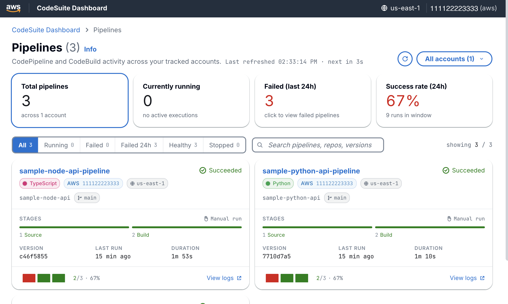
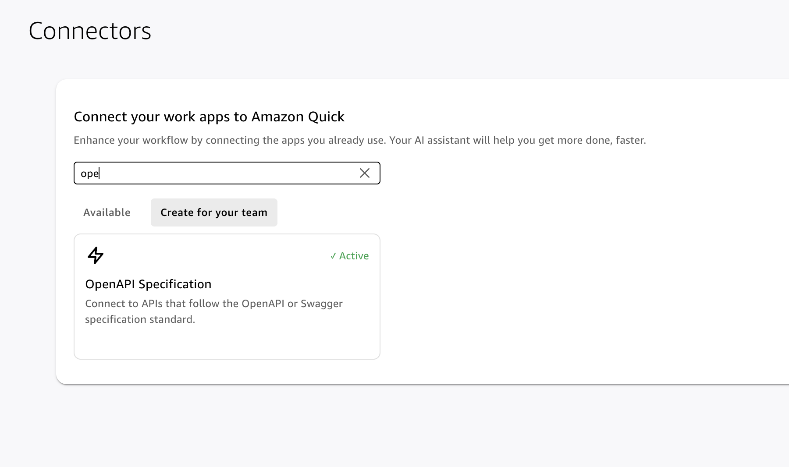
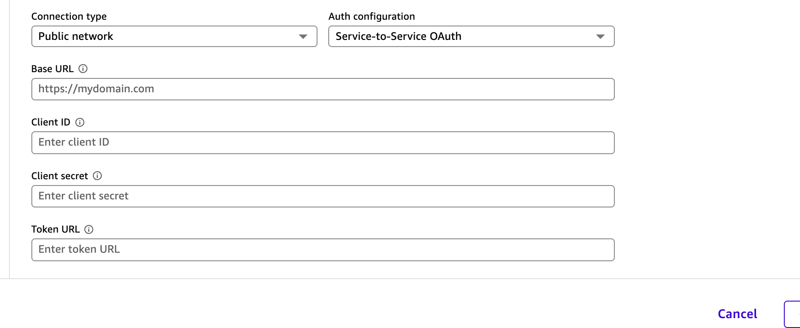

# AWS Code Suite Dashboard

_Cross-account visibility for AWS CodePipeline and CodeBuild, with an AWS DevOps Agent chat assistant._



It captures every pipeline execution and build event into a central data lake,
enriches it with per-stage detail, exposes it through an HTTP API, and renders
it as an **app in Amazon Quick**. A local React dashboard is included as an
optional developer view over the same API.

The local React dashboard also embeds an **AWS DevOps Agent** chat, so users
can ask natural-language questions about a specific pipeline ("why is this
failing?", "which stage is the bottleneck?") and get answers backed by
the agent's live investigation of AWS resources. The chat is not available
in the Amazon Quick app.

The infrastructure is deployed with **CloudFormation** (`cloudformation/`) —
three self-contained stacks (central backend, cross-account reader, and
optional sample pipelines) driven through the Makefile.

## Architecture

At a high level, pipeline and build events are captured, archived and enriched
in an S3 data lake, then served to a dashboard through an HTTP API:


A few design points worth calling out:

- **The same events fan out to two independent paths.** A cheap Firehose-to-S3
  archive keeps the full raw history for forensics, while an enrichment Lambda
  produces query-friendly rows for the live dashboard.
- **Multi-account aggregation uses AWS Organizations.** A CloudFormation
  StackSet deploys a read-only reader role into every member account; the stats
  Lambda assumes it to aggregate pipelines across the organization.
- **One API serves two frontends.** The app in Amazon Quick calls it through a
  JWT-authorized connector; the optional local React dashboard calls the same
  API with SigV4.

Diagrams are generated with the [`diagrams`](https://diagrams.mingrammer.com/)
library. See [`docs/diagrams/`](docs/diagrams/) for a per-concept diagram of
each point above (data paths, multi-account, serving), the detailed deployed
stack, and how to regenerate them.

### Primary frontend: an app in Amazon Quick

The dashboard is built as an **app in Amazon Quick**, reached through an
OAuth2-authorized OpenAPI **connector**. The connector adds a Cognito-backed
JWT authorizer and a set of flat, paginated `/connector/*` routes alongside the
backend's IAM routes.


See [`cloudformation/dashboard-backend/QUICK_APP_QUICKSTART.md`](cloudformation/dashboard-backend/QUICK_APP_QUICKSTART.md)
for the end-to-end deploy-and-build walkthrough.

### Optional frontend: the local React dashboard

For local development the same backend drives a React UI on
`http://localhost:5173`. The Vite dev server proxies `/api/*` to the HTTP API
and signs every request with SigV4 using the developer's local AWS credentials
(the Quick sandbox cannot sign SigV4, which is why the app uses the connector
instead) — the browser never sees AWS credentials and the API never accepts
unsigned requests.

## Repo layout

```
.
├── cloudformation/             # CloudFormation IaC (3 self-contained stacks)
│   ├── dashboard-backend/      # Lambdas, API GW, S3 + Glue + Athena, Firehose, EventBridge
│   ├── cross-account-reader/   # IAM role deployed into each target account
│   └── sample-pipelines/       # 3 demo pipelines (Python / Node / static) — OPTIONAL, for testing
├── frontend/                   # React + Vite + Tailwind UI (local-only)
├── scripts/                    # Python helpers (e.g. SigV4 API caller)
└── Makefile                    # single entrypoint — see `make help`
```

## Prerequisites

- AWS CLI v2, logged in to the central account
- Node 20+ and npm (for the dashboard UI)
- Python 3.10+ (for `scripts/awscall.py` and CodeCommit's git remote helper)
- `git-remote-codecommit` for seeding sample pipelines:
  `pip install --user git-remote-codecommit`
- AWS credentials for the identity that runs the dashboard, with
  `execute-api:Invoke` on the API. The [Quick start](#quick-start) attaches
  the `ApiInvokePolicyArn` managed policy, which grants this.

## Quick start

Create a one-time packaging bucket for the Lambda zips, then deploy the central
backend:

```bash
export CFN_PKG_BUCKET=cfn-pkg-$(aws sts get-caller-identity --query Account --output text)-us-east-1
aws s3 mb "s3://$CFN_PKG_BUCKET"
make deploy-cfn-dashboard
```

Optionally deploy and seed demo pipelines so the dashboard has data. Skip this
if you already have real CodePipeline/CodeBuild activity, or plan to onboard
tracked accounts and use their pipelines instead:

```bash
make deploy-cfn-sample-pipelines
make seed-cfn-samples
```

Seeding doesn't start the pipelines, so start each one once:

```bash
for p in sample-node-api-pipeline sample-python-api-pipeline sample-static-site-pipeline; do
  aws codepipeline start-pipeline-execution --name "$p"
done
```

Attach the API invoke policy (the `ApiInvokePolicyArn` output from the backend
deploy) to the principal that will call the API. The command below is for an
IAM user. For a role, use `aws iam attach-role-policy` instead; an admin role
already has access.

```bash
aws iam attach-user-policy \
  --user-name $(aws sts get-caller-identity --query Arn --output text | awk -F/ '{print $NF}') \
  --policy-arn $(aws cloudformation describe-stacks \
    --stack-name pipeline-dashboard \
    --query 'Stacks[0].Outputs[?OutputKey==`ApiInvokePolicyArn`].OutputValue' \
    --output text)
```

See `cloudformation/README.md` for per-stack deploy details and the
parameters each stack accepts.

## Build the app in Amazon Quick

Use a Region where Amazon Quick is available. Creating a connector needs a
Quick **Enterprise** subscription.

### 1. Deploy the backend with the connector

Pick a globally unique prefix for the connector's Cognito sign-in domain, for
example `pipeline-dashboard-<your-account-id>`:

```bash
make deploy-cfn-connector CONNECTOR_DOMAIN_PREFIX=<unique-prefix>
make render-quick-app
```

`render-quick-app` writes two gitignored files to
`cloudformation/dashboard-backend/connector/`: `openapi.generated.json` (the
connector definition) and `QUICK_APP_PROMPT.generated.md` (the app prompt).

### 2. Find the connector values

You need five values. Four are outputs of the `pipeline-dashboard` stack, and
the client secret is in Amazon Cognito.

| Quick form field | Value | Where to find it |
|---|---|---|
| **Base URL** | `ConnectorBaseUrl` output, ending in `/connector` | CloudFormation console → **Stacks** → `pipeline-dashboard` → **Outputs** tab |
| **Client ID** | `ConnectorClientId` output | Same **Outputs** tab |
| **Token URL** | `ConnectorTokenUrl` output, ending in `/oauth2/token` | Same **Outputs** tab |
| **Scope** (if the form asks) | `ConnectorScope` output: `pipeline-dashboard/read` | Same **Outputs** tab |
| **Client secret** | The app client's secret | Amazon Cognito console → **User pools** → `pipeline-dashboard-connector` → **App clients** → the app client → **Show client secret** |

Open the consoles in the Region where you deployed the stack. To get the same
values from the CLI instead:

```bash
# Base URL, client ID, token URL and scope
aws cloudformation describe-stacks --stack-name pipeline-dashboard \
  --query 'Stacks[0].Outputs[?starts_with(OutputKey, `Connector`)].[OutputKey,OutputValue]' \
  --output table

# Client secret
POOL_ID=$(aws cognito-idp list-user-pools --max-results 60 \
  --query "UserPools[?Name=='pipeline-dashboard-connector'].Id | [0]" --output text)
CLIENT_ID=$(aws cloudformation describe-stacks --stack-name pipeline-dashboard \
  --query 'Stacks[0].Outputs[?OutputKey==`ConnectorClientId`].OutputValue' --output text)
aws cognito-idp describe-user-pool-client --user-pool-id "$POOL_ID" --client-id "$CLIENT_ID" \
  --query 'UserPoolClient.ClientSecret' --output text
```

Treat the client secret like a password. Don't commit it or share it.

### 3. Add the connector in Quick

1. In the Quick console, open **Connectors**, choose the **Create for your
   team** tab, and search for `OpenAPI`. Choose **OpenAPI Specification**.

   

   The **Available** tab lists only connectors that already exist. If
   **Create for your team** is empty, your Quick user needs an Enterprise
   subscription.

2. Import `cloudformation/dashboard-backend/connector/openapi.generated.json`.
   For **Description**, use only letters, numbers, spaces and `_ . , ! ? -`,
   for example `Read-only connector for the AWS Code Suite Dashboard.`
3. Fill in the connection form with the values from step 2:

   

   - **Connection type:** Public network
   - **Auth configuration:** Service-to-Service OAuth
   - **Base URL:** `ConnectorBaseUrl`. Paste it, with no trailing slash.
   - **Client ID:** `ConnectorClientId`
   - **Client secret:** the secret from Cognito
   - **Token URL:** `ConnectorTokenUrl`
   - **Scope:** `pipeline-dashboard/read`, if the form asks for it

4. Check that four actions appear: `getStats`, `getAccounts`, `getPipelines`
   and `getPipeline`.
5. Publish the connector. **Everyone in your organization** is a reasonable
   choice: the connector is read-only and returns only pipeline and build
   metadata. All users share one credential, so restrict it if your pipeline
   or account names are sensitive.

### 4. Build and publish the app

Go to **Apps → Create app**, choose the connector, and paste the whole of
`connector/QUICK_APP_PROMPT.generated.md` as one message. It rebuilds the
local React dashboard in Quick. When it looks right, choose **Publish** and
share it with your Quick users.

The Quick app can run in a different account from the backend, such as a
member account of your organization, because the connector reaches the API
over HTTPS with OAuth. See
[`QUICK_APP_QUICKSTART.md`](cloudformation/dashboard-backend/QUICK_APP_QUICKSTART.md)
for what to check in the app and how to tear everything down.

## Running the local React dashboard

This is the optional developer view. To build the primary Amazon Quick app, see
[`cloudformation/dashboard-backend/QUICK_APP_QUICKSTART.md`](cloudformation/dashboard-backend/QUICK_APP_QUICKSTART.md).

```bash
make install-dashboard   # first time only — npm install
make run-dashboard       # http://localhost:5173
```

`frontend/.env` holds `VITE_API_URL`. It must point at the API you deployed
(the `StatsApiUrl` output from `make deploy-cfn-dashboard`). The Vite dev
server signs every
`/api/*` request with SigV4 using your local AWS credential chain — no
secrets ever live in the browser.

## Multi-account / Organizations

### Track every account in your AWS Organization

Run these from the organization's **management account**. Member accounts
can't list the organization's accounts or deploy organization-wide StackSets.
Trusted access for CloudFormation StackSets must be turned on for the
organization (CloudFormation console → StackSets → **Activate trusted
access**).

1. Find your organization root ID:

   ```bash
   aws organizations list-roots --query 'Roots[0].Id' --output text
   ```

2. Deploy (or redeploy) the dashboard with organization tracking on, with
   `CFN_PKG_BUCKET` set as in the [Quick start](#quick-start):

   ```bash
   make enable-org-tracking ROOT_ID=r-xxxx
   ```

3. Check it worked. Every account in the organization should be listed:

   ```bash
   make list-tracked-accounts
   ```

This deploys a read-only `PipelineDashboardReader` role into every account
in the organization, including accounts that join later. The dashboard then
finds the accounts and reads their pipelines automatically.

### Track a single account

From any account, without Organizations:

```bash
make track-account PROFILE=<other-aws-profile> ALIAS=<short-label>
```

This deploys the reader role into that account and prints an entry to add to
the stack's `TrackedAccounts` parameter. Then run `make deploy-cfn-dashboard`.

## DevOps Agent chat

The local React dashboard has an **Ask DevOps Agent** chat. Pick a pipeline
and ask a question, such as "Why is this pipeline failing?", and
[AWS DevOps Agent](https://aws.amazon.com/devops-agent/) investigates your
AWS resources, including CodeBuild logs, to answer. Answers take 20–90
seconds.

> [!IMPORTANT]
> The chat is not available in the Amazon Quick app. The Quick connector is
> read-only, and the chat needs SigV4-signed `POST` requests.

To turn it on:

1. [Create an AgentSpace](https://docs.aws.amazon.com/devopsagent/latest/userguide/getting-started-with-aws-devops-agent-creating-an-agent-space.html)
   in the same account and region as the dashboard, with this account
   associated.
2. Redeploy with its ID:

   ```bash
   make deploy-cfn-dashboard DEVOPS_AGENT_SPACE_ID=<agent-space-id>
   ```

Without an AgentSpace, the rest of the dashboard works normally and the chat
shows "AWS DevOps Agent isn't set up" with a setup link.

DevOps Agent is billed per investigation, and each question starts one. See
[pricing](https://aws.amazon.com/devops-agent/pricing/).

Setup details, how it works, and troubleshooting:
[`docs/devops-agent-chat.md`](docs/devops-agent-chat.md).

## Security model

- **API:** every route on the HTTP API has `AuthorizationType: AWS_IAM`.
  Unsigned requests get HTTP 403. To call the API a principal must have
  `execute-api:Invoke` on the route ARN — the deploy outputs a managed policy
  (`ApiInvokePolicyArn`) you can attach to whoever needs access. See
  [Prerequisites](#prerequisites) for the exact permissions needed by the
  IAM identity that runs the dashboard locally.
- **S3 buckets:** all four public-access-block flags on. Bucket policies
  deny non-TLS access. No public website hosting.
- **Cross-account:** the reader role's trust policy is locked to the central
  stats Lambda role ARN.
- **Lambdas:** AWS-managed encryption on env vars + CloudWatch logs.
  No Function URLs. Permissions scoped to specific resource ARNs where
  AWS supports it.
- **DevOps Agent:** the chat-worker Lambda's IAM allows only
  `aidevops:GetAgentSpace`, `aidevops:CreateChat` and `aidevops:SendMessage`,
  scoped to the configured AgentSpace ARN — it cannot start investigations against any
  other AgentSpace. The AgentSpace's own monitoring role
  (`AIDevOpsAgentAccessPolicy`) is read-only. The chat state table is
  encrypted at rest and auto-expires records after 24 hours.

## Common operations

| Command | What it does |
|---|---|
| `make help` | List all targets. |
| `make plan-cfn-dashboard` | Create a CloudFormation change set without applying it. |
| `make deploy-cfn-dashboard` | Deploy the central backend stack. |
| `make destroy-cfn-dashboard` | Tear the stack down. |
| `make list-tracked-accounts` | Call `GET /accounts` via SigV4 and format with jq. |

## Conventions

Highlights of the project style guide:

- Always go through the Makefile — don't invent new `cloudformation deploy`
  invocations.
- API calls live in `frontend/src/pipelineService.js`; keep `App.jsx`
  free of `fetch`.
- Never hardcode `VITE_API_URL` — it comes from the `.env` at build time.
- Never commit `.env` or secrets — `.env` is already gitignored.

## Security

See [SECURITY](SECURITY.md) for how to report security issues.

## License

This library is licensed under the MIT-0 License. See the [LICENSE](LICENSE) file.
