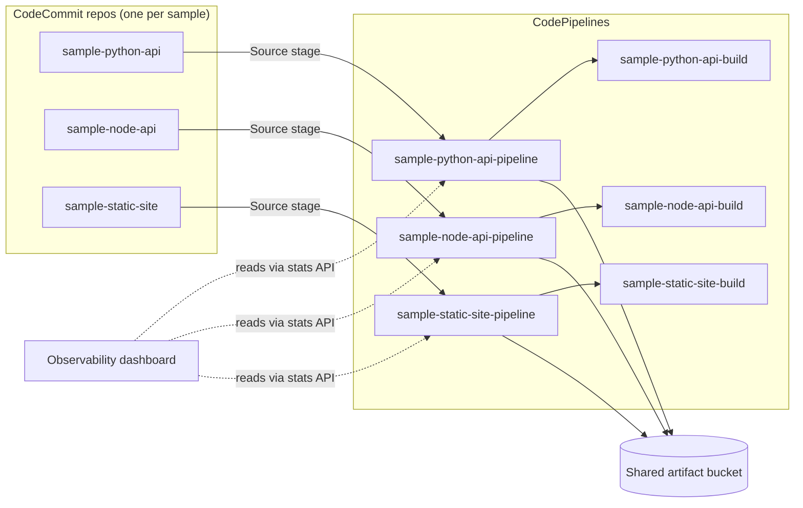

# Sample Pipelines

Three deployable CodePipelines used to give the
`aws-code-suite-observability` dashboard real data to render. Apply this
stack and the dashboard goes from "0 pipelines" to a populated grid in
about two minutes.

This folder is also designed to stand on its own as a worked example for a
blog post: clone the repo, run two `make` targets, and you have a working
multi-pipeline CodePipeline setup with seeded source code, builds, and
artifacts.

## What gets created



- **Three CodeCommit repos**, each seeded with a tiny app (Flask, Express,
  static HTML) and a `buildspec.yml`.
- **Three CodeBuild projects** that run the sample's tests/lints.
- **Three CodePipelines** that wire Source → Build.
- **One shared artifact bucket** with versioning, SSE, and public access
  blocked.
- **Two IAM roles** (one for CodePipeline, one for CodeBuild) scoped to
  the resources this stack creates — no `Resource = "*"`.
- **`AlertSeverity` tags** (`high`, `medium`, `low`) on each pipeline so
  the future `pipeline-failure-alerts` feature has something to route on.

Everything is keyed off a `samples` map variable, so adding a fourth
sample is one entry in `variables.tf` and one new folder under
`sample-apps/`.

## Prerequisites

- AWS credentials in your shell (`aws sts get-caller-identity` works).
- `git` installed locally (used to push the seed commits).
- `aws codecommit` credential helper or `git-remote-codecommit` resolvable
  on `PATH`. The macOS Homebrew install is one of:

  ```
  brew install awscli            # already provides the credential helper
  pip install git-remote-codecommit
  ```

- The dashboard backend deployed (`make deploy-dashboard`) so the
  pipelines show up in the UI.

## Deploy

From the repo root:

```
make deploy-sample-pipelines
```

That's a thin wrapper over `terraform -chdir=terraform/sample-pipelines
apply`. First apply takes ~90s — CodeCommit repos, IAM, CodeBuild, and
CodePipelines are created in parallel; the seed `git push`es happen
serially per repo.

Refresh the dashboard at `http://localhost:5173` — three pipelines should
appear within a few seconds. The first build for each runs automatically
because pushing the seed commit to `main` is the trigger.

## Iterate on a sample

The repos are real CodeCommit repos. To watch the pipeline rerun:

```
git clone codecommit::us-east-1://sample-python-api
cd sample-python-api
# edit app.py
git commit -am "tweak something"
git push
```

CodePipeline picks the commit up via EventBridge and re-runs Source →
Build. The dashboard reflects the new execution within ~10 seconds.

## Tear down

```
make destroy-sample-pipelines
```

This empties the artifact bucket (`force_destroy = true`) and deletes
every resource the stack created. CodeCommit repos go with it, so any
commits you pushed are gone too.

## Adding a new sample

1. Drop a new folder under `sample-apps/` with at least `buildspec.yml`
   and whatever source files the build needs.
2. Add an entry to the `samples` map in `variables.tf`:

   ```hcl
   ruby-api = {
     source_dir   = "ruby-api"
     description  = "Ruby/Sinatra service with RSpec."
     severity_tag = "medium"
   }
   ```
3. `make deploy-sample-pipelines` again — Terraform creates the repo,
   build, and pipeline, then seeds the repo with your new app.

## Why CodeCommit?

The rest of this project standardised on CodeCommit before AWS restricted
new-customer access in July 2024, so existing accounts can still use it.
For a brand-new account, swap the source stage in
`terraform/modules/codepipeline/main.tf` for a CodeStar Connection +
GitHub source — the rest of this stack stays unchanged.
